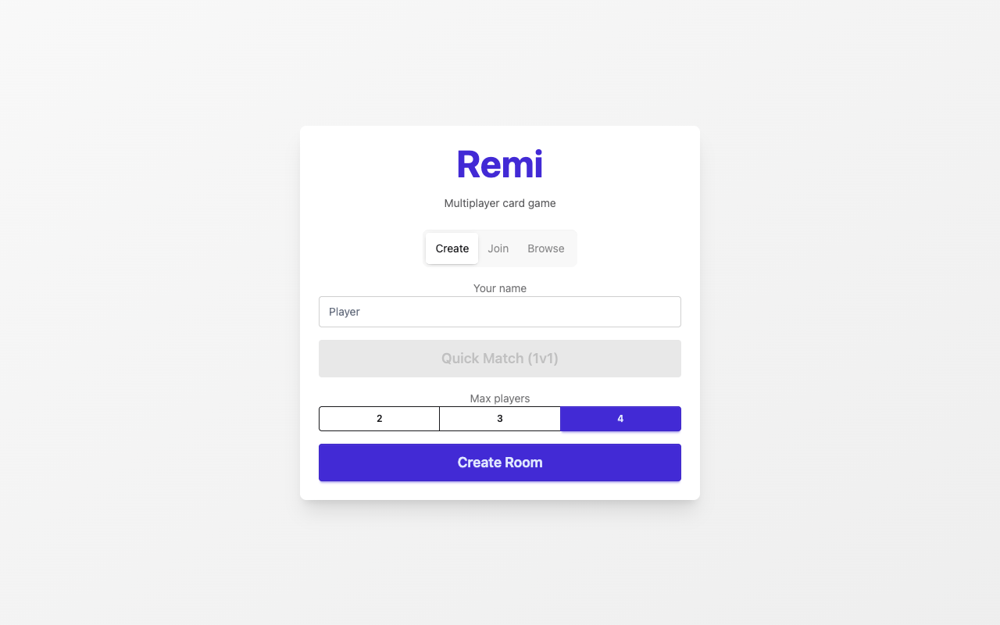
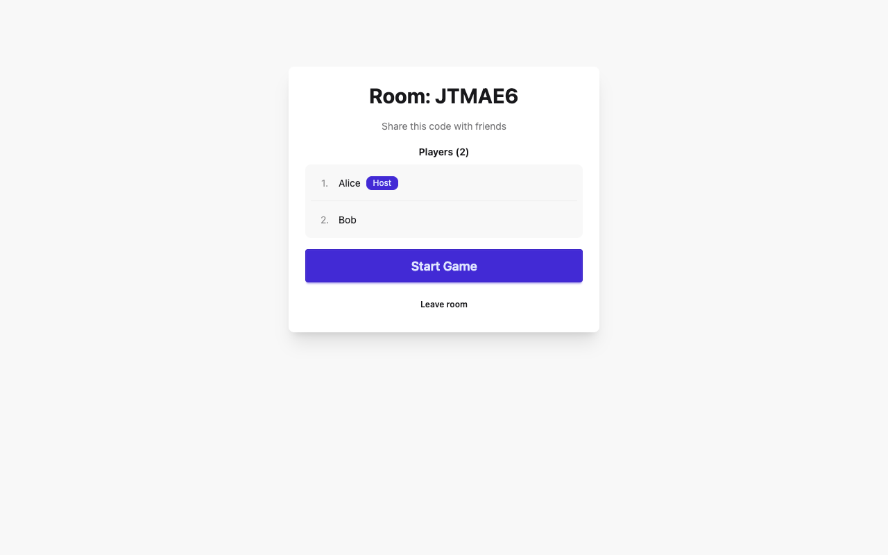
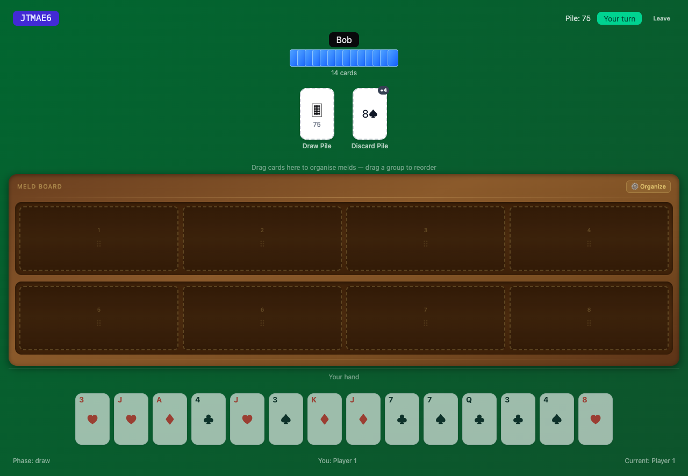
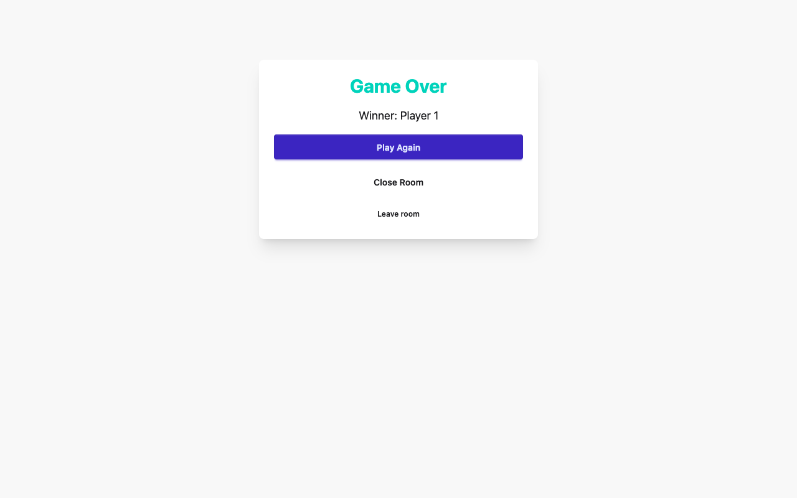

# Remi — Multiplayer Card Game

A multiplayer Romanian rummy (remi) card game built with SvelteKit. Play against AI opponents or challenge friends online.

## Screenshots

| Home | Room Lobby |
|------|------------|
|  |  |

| Game Board | Game Over |
|-----------|-----------|
|  |  |

## Features

- **Online multiplayer** — Create or join rooms, play with 2–4 players
- **Quick Match (1v1)** — Auto-match against another player with MMR ratings
- **AI opponents** — Play solo against AI in local games
- **Real-time polling** — Room state syncs via periodic polling
- **Meld staging** — Drag cards to organise melds before going out
- **Joker support** — Colored and black jokers for wild-card melds
- **MMR system** — Competitive ratings for 1v1 matches

## Tech

- **Framework:** [SvelteKit](https://kit.svelte.dev/) (Svelte 5 with runes)
- **Database:** MongoDB via `mongodb-memory-server` (ephemeral, no external DB needed)
- **Styling:** Tailwind CSS + daisyUI
- **E2E tests:** Playwright
- **Unit tests:** Vitest

## Development

```sh
pnpm install
pnpm run dev
```

Open [localhost:5173](http://localhost:5173).

## Testing

```sh
# Unit tests
pnpm run test:unit

# E2E tests (builds app, starts MongoDB)
pnpm run test:e2e

# Playwright UI mode
pnpx playwright test --ui
```

## How to Play

Remi is a rummy variant. Each player is dealt 14 cards. On your turn:

1. **Draw** — Take a card from the draw pile or the discard pile
2. **Discard** — Discard one card from your hand
3. **Close** — If your hand can form valid melds covering all but one card, you can go out

Melds are sets (same value, different suits) or sequences (consecutive values, same suit). Jokers can substitute any card.
