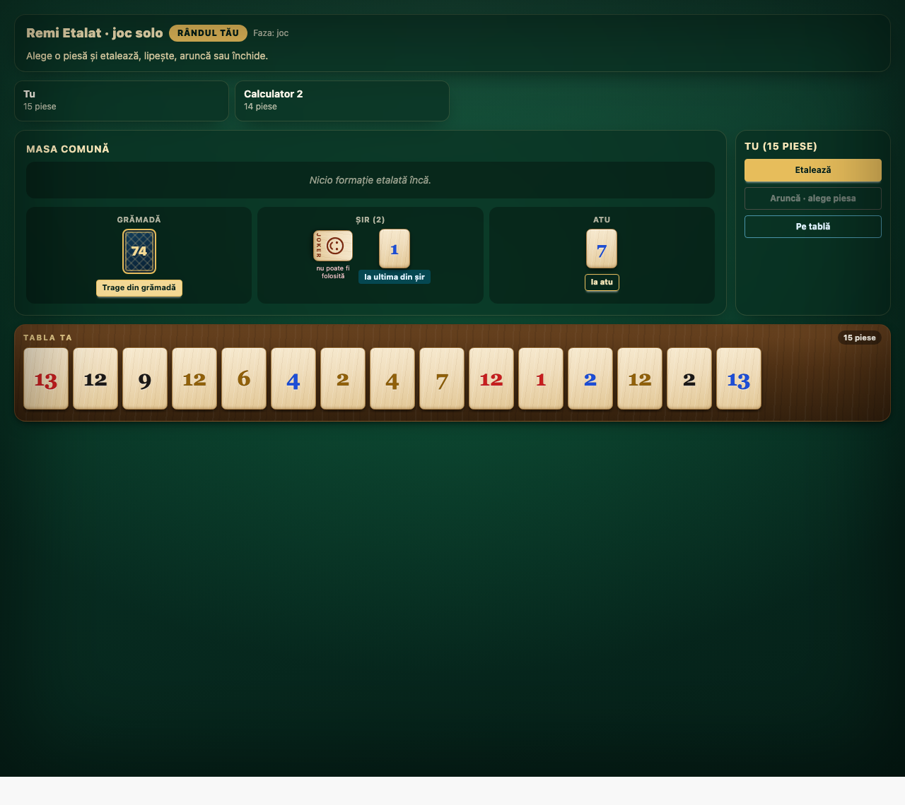
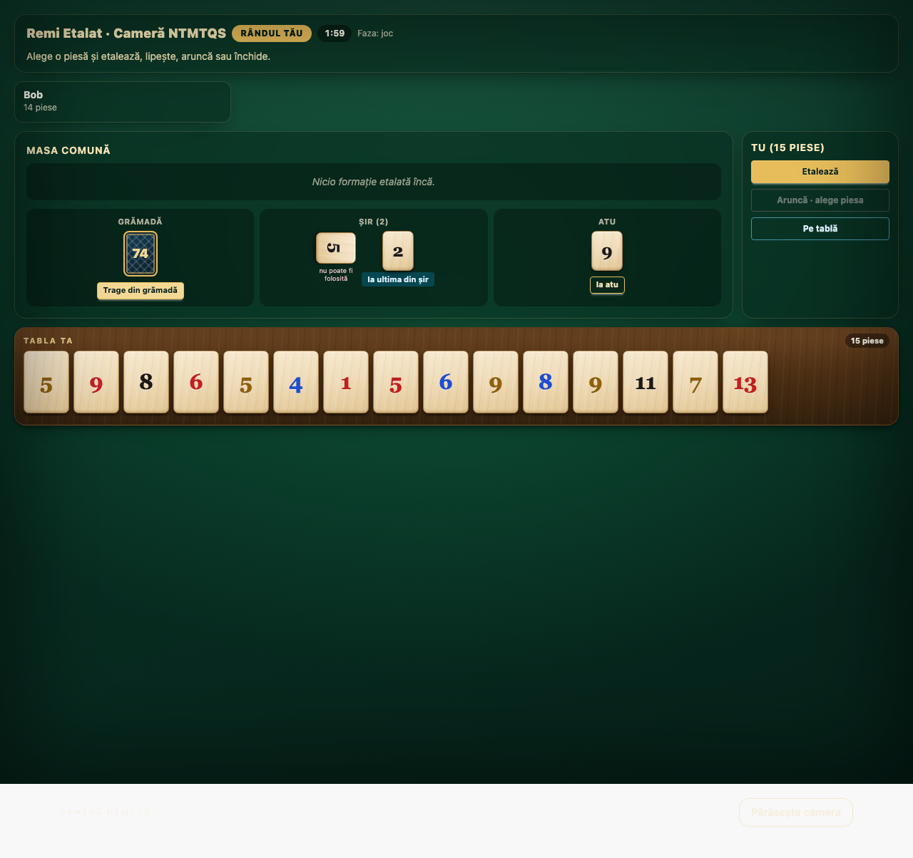

# Remi Etalat

Remi Etalat este jocul clasic român de remi cu piese, pentru 2–4 jucători: 106 piese (valorile 1–13 în patru culori — roșu, galben, albastru, negru — câte două exemplare din fiecare, plus 2 jokers identici), în două variante: **etalat**, cu formații pe masa comună, și **joc pe tablă**, cu modele construite privat. Joacă împotriva calculatorului sau online, în camere cu prietenii; întreaga interfață este în română.

## Cum se joacă

### Piese, duble, atu

- **Piese:** 106 în total (104 + 2 jokers, numiți și „joly”/„gioni”). Jocul continuă în sens trigonometric.
- **Dublă:** două piese identice (aceeași valoare _și_ culoare): **dublă mică** (2–9), **dublă mare** (10–13), **dublă cheie/cui** (1). Înainte de joc, jucătorii își anunță dublele și fac **schimb orb** între categorii (valorile rămân ascunse). Cine are **3+ duble** poate apăsa **„Strică jocul”** — amestecarea și împărțirea se iau de la capăt.
- **Atu:** piesa rămasă după împărțire, vizibilă pe masă. Cine deține piesa identică poate anunța **„atu”** înainte de prima tragere → **+50** la punctaj. Dacă atuul este **1 sau joker**, e **joc dublu**: toate scorurile se dublează.

### Tura

- Primul jucător (cel cu 15 piese; ceilalți au 14) deschide jocul **aruncând o piesă**, fără tragere. Această primă piesă începe **șirul**, se pune lateral și rămâne **moartă** tot jocul — nimeni nu o poate lua.
- Celelalte turi: **trage o piesă**, opțional **etalează**, apoi **aruncă o piesă** (maxim 14 piese pe raft la final).
- Poți trage din **grămadă** (vârful), din **ultima piesă a șirului** sau din **atu** — ultimele două doar dacă piesa e folosită într-o formație în aceeași tură.
- **Prima rundă:** etalarea nu e permisă până nu se încheie prima rundă (de la a doua tură a fiecărui jucător).

### Combinații

- **Suită:** minimum 3 piese consecutive de aceeași culoare. **1** merge doar în **1-2-3** sau **12-13-1**, niciodată în mijloc.
- **Terță:** 3–4 piese de aceeași valoare, în culori diferite.
- **Jokerii** înlocuiesc orice piesă, cu limite: o formație cu **1 joker** are nevoie de **≥2 piese reale**; una cu **2 jokers**, de **≥4 piese reale**, iar cei doi jokers **nu pot fi alăturați** (în suită).

### Etalare, lipire și schimbul jokerului

- **Prima etalare** a jocului: minimum **45 de puncte** și cel puțin **o suită** (excepție: o **terță de 1** se poate etala fără suită).
- Mai departe: etalări fără restricții și **lipire** pe orice formație de pe masă (proprie sau a adversarilor), cu condiția ca formația să rămână validă. Piesele lipite îți aparțin (etichetă digitală de proprietar). **Jokerii nu se lipesc la formațiile adversarilor** — doar la ale tale.
- **Schimbul jokerului:** un joker de pe masă poate fi înlocuit **o singură dată** de către orice jucător care deține piesa exactă pe care jokerul o înlocuiește; jokerul ajunge la el și trebuie folosit într-o formație în aceeași tură; jokerii schimbați nu se mai pot schimba.
- **Ruperea șirului:** orice piesă în afara celei dintâi (moarte), doar dacă ești deja etalat, ai cel puțin 3 piese pe raft, iar piesa ruptă intră într-o formație în aceeași tură; piesa ruptă și toate cele după ea vin pe raftul tău.

### Închiderea

Un jucător **închide** când își termină piesele — ultima piesă aruncată este piesa de închidere (**+50**). Dacă **grămada se termină** înainte să închidă cineva, jocul se încheie fără bonus de închidere. **Câștigătorul e jucătorul cu cele mai multe puncte**, nu neapărat închizătorul. Sistemul afișează automat „mai are 2 piese” când un jucător ajunge la maximum 2 piese pe raft.

### Joc pe tablă

Un jucător poate declara **„joc pe tablă”** în **primele 3 turi**. Jucătorul pe tablă:

- construiește formații **privat pe tabla lui**, fără a etala pe masa comună;
- **nu poate lipi** la formațiile altor jucători și **nu poate folosi jokerii** de pe masă;
- poate lua doar **ultima piesă a șirului** (nu poate rupe șirul);
- trage câte o piesă pe tură și **nu aruncă** (interpretare digitală): piesele se acumulează în modelul privat până la completare;
- dacă altcineva închide primul, ia **−100**.

Modelul este validat continuu (progresul e vizibil); la completare, jucătorul închide și primește bonusul:

| Tip       | Observații                                                                                                                                                  | Punctaj |
| --------- | ----------------------------------------------------------------------------------------------------------------------------------------------------------- | ------- |
| Simplu    | suite și terțe, fără restricții (toate piesele de pe raft aranjate legal)                                                                                   | 500     |
| Bete      | 2 terțe de câte 4 piese + 2 terțe de câte 3 piese                                                                                                           | 700     |
| Mozaic    | suită completă `1…13,1`; nu există 2 piese consecutive de aceeași culoare; primele 4 piese sunt de cele 4 culori; primul 1 are altă culoare decât ultimul 1 | 1000    |
| Bicolor   | 2 suite complete în 2 culori                                                                                                                                | 1200    |
| Duble     | 7 perechi de duble identice                                                                                                                                 | 1300    |
| Monocolor | suită completă `1…13,1`, toate piesele de aceeași culoare                                                                                                   | 1500    |

Mozaic, Bicolor și Monocolor sunt **doar cu piese naturale** (fără jokers).

### Punctajul final

Per jucător, la sfârșitul jocului:

- piese etalate + lipite: **2–9 = 5 puncte, 10–13 = 10, 1 = 25, joker = 50**; scazi piesele rămase pe raft (aceleași valori);
- **+50** bonus de închidere (fără bonus dacă jocul s-a terminat prin epuizarea grămazii);
- **+50** bonus atu, dacă a fost anunțat;
- jucător **neetalat** (care n-a jucat pe tablă): **−100** fix (piesele de pe raft nu se mai numără); cu atu anunțat: **−50** net;
- închidere cu **joker aruncat**: totalul închizătorului se **dublează**; **joc dublu**: toate scorurile **×2** (combinația cu joker la închidere: **×4** pentru închizător);
- **joc pe tablă** completat: bonusul modelului (500–1500), plus atu și multiplicatorul jocului dublu, în loc de scorul normal; model abandonat = **−100**.

## Tehnologii

- **SvelteKit** (Svelte 5 cu runes) + **TypeScript**
- **Tailwind CSS** (+ daisyUI)
- **MongoDB** (prin `mongodb-memory-server` pentru dezvoltare/teste)
- **Vitest** (teste unitare) și **Playwright** (teste E2E)

## Dezvoltare

```sh
pnpm install
pnpm dev          # http://localhost:5173
pnpm build
pnpm test:unit    # teste unitare (Vitest)
pnpm test:e2e     # teste E2E (Playwright)
```

## Capturi de ecran

| Pagina principală                                 | Cameră / lobby                         |
| ------------------------------------------------- | -------------------------------------- |
|  |  |

| Tablă de joc (solo)                              | Tablă de joc (multiplayer)                              |
| ------------------------------------------------ | ------------------------------------------------------- |
|  |  |
