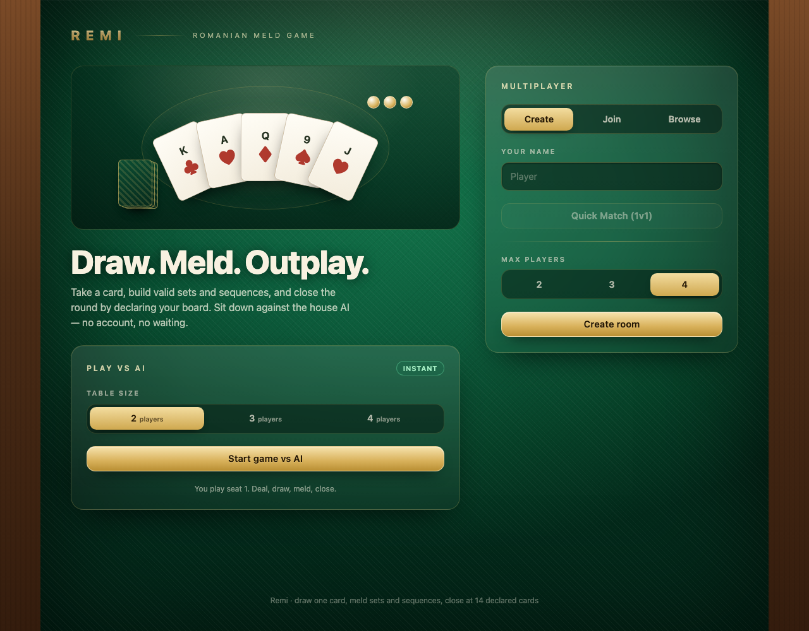
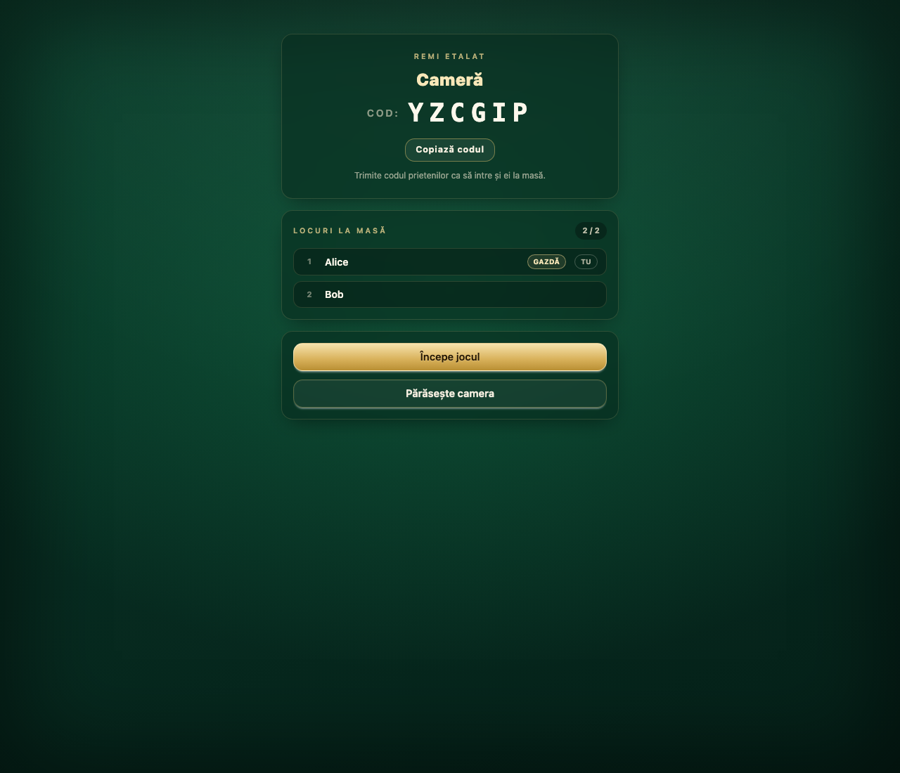
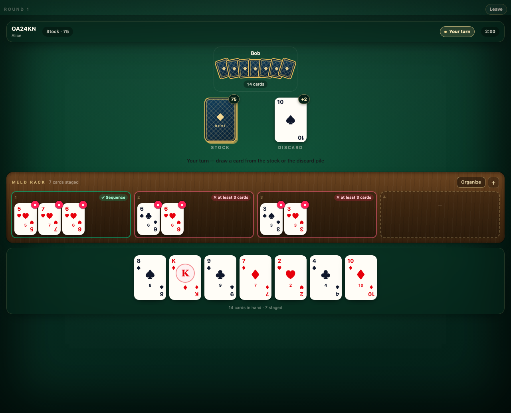
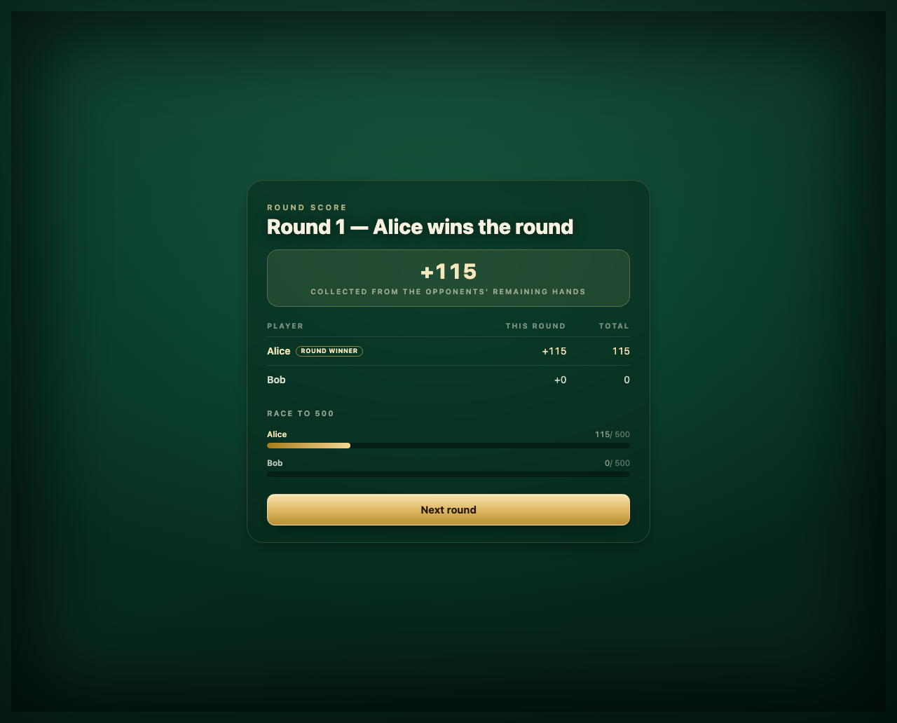

# Remi — Multiplayer Card Game

A multiplayer Romanian rummy (remi) card game built with SvelteKit. Play against AI opponents or challenge friends online.

## Screenshots

| Home                                 | Room Lobby                             |
| ------------------------------------ | -------------------------------------- |
|  |  |

| Game Board                                       | Round Score Sheet                                  |
| ------------------------------------------------ | -------------------------------------------------- |
|  |  |

## Features

- **Play vs AI** — Solo games with 2–4 players, straight from the home screen
- **Online multiplayer** — Create or join rooms, play with 2–4 players
- **Quick Match (1v1)** — Auto-match against another player with MMR ratings
- **Real-time polling** — Room state syncs via periodic polling
- **Meld board** — Stage and reorder your melds on a private board before closing
- **Validated closes** — Every close is checked for real melds, sets and sequences
- **Joker support** — Colored and black jokers as wild cards (max one per meld)
- **Rounds & scoring** — Play rounds to 500 points, with a score sheet after each round
- **Turn timer** — 2-minute turn limit in multiplayer with automatic play on timeout
- **MMR system** — Ratings recorded at match end for 1v1 quick match only

## Tech

- **Framework:** [SvelteKit](https://kit.svelte.dev/) (Svelte 5 with runes)
- **Database:** MongoDB via `mongodb-memory-server` (ephemeral, no external DB needed)
- **Styling:** Tailwind CSS + daisyUI
- **E2E tests:** Playwright
- **Unit tests:** Vitest

## Development

```sh
pnpm install
pnpm run dev
```

Open [localhost:5173](http://localhost:5173).

## Testing

```sh
# Unit tests
pnpm run test:unit

# E2E tests (builds app, starts MongoDB)
pnpm run test:e2e

# Playwright UI mode
pnpx playwright test --ui
```

## How to Play

Remi is a rummy variant. Each player is dealt **14 cards**. On your turn:

1. **Draw** — Take exactly one card from the draw pile or the discard pile
2. **Discard** — Discard one card to end your turn, or
3. **Close** — Go out instead of discarding (only right after drawing)

### Closing

To close, you must have **exactly 14 of your 15 cards** staged on your meld board as valid melds, with **at least 1 set and 1 sequence** among them. The 15th card is discarded as your closing move.

Each meld must have:

- **3 or more cards**
- **At least 2 natural cards** (non-joker)
- **At most 1 joker**

Melds are sets (same value, different suits) or sequences (consecutive values, same suit). Jokers can substitute any card.

### Scoring

When you close, you collect the value of every opponent's remaining hand: numbers at face value, **A/J/Q/K = 10**, and any **joker = 25**. Rounds repeat until a player reaches **500 points** and wins the match — the previous round's winner starts the next round.

### Multiplayer

Multiplayer turns are limited to **2 minutes**; if time runs out your turn is played automatically. **MMR** is recorded at the end of the match for **1v1 quick match** only — 3–4 player rooms are casual.
